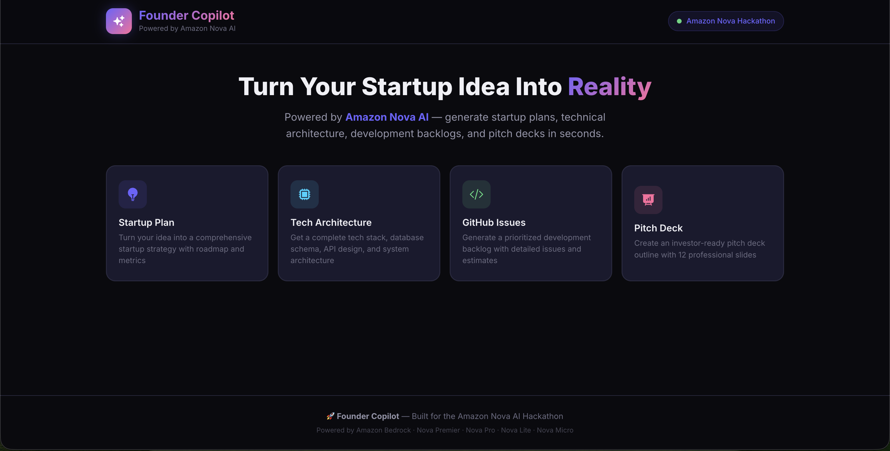
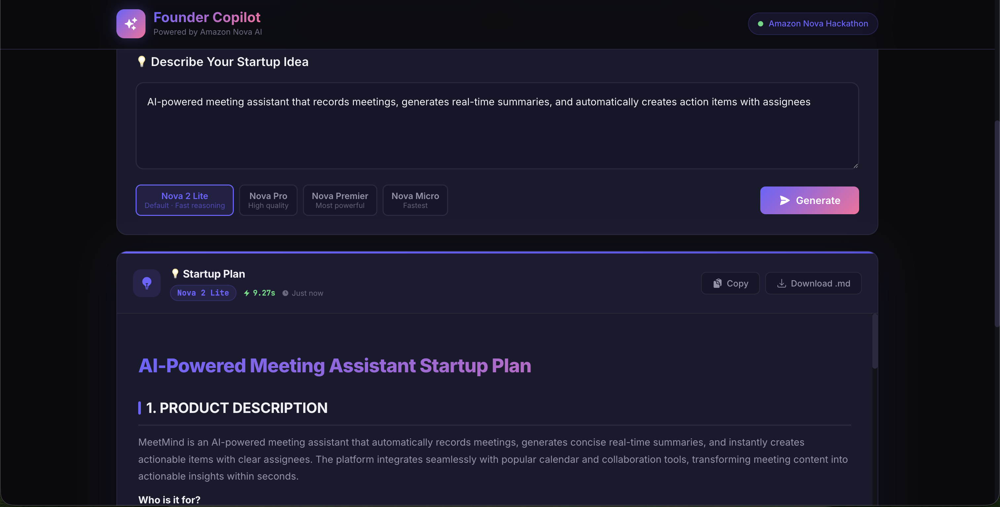
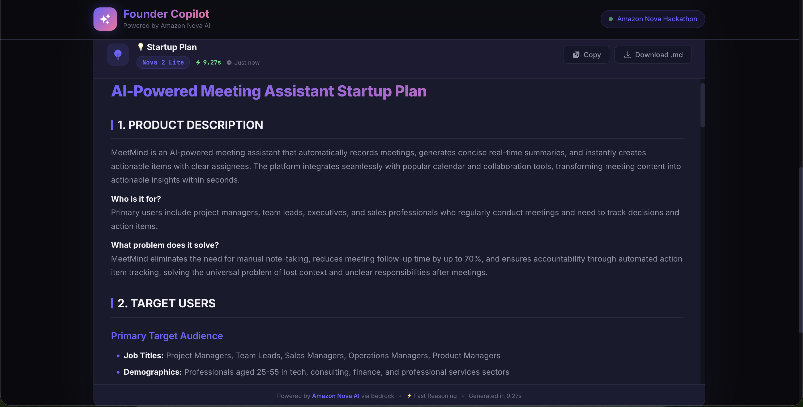
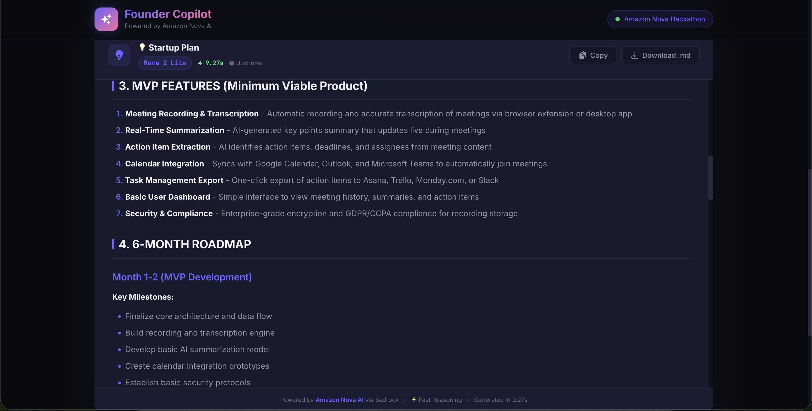
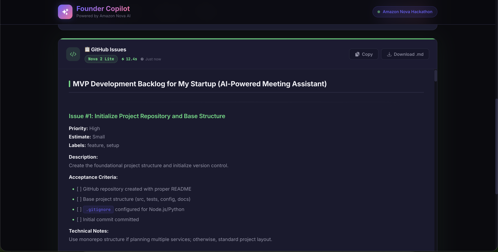
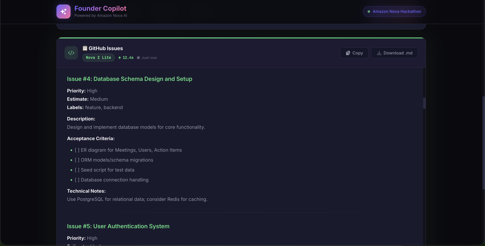
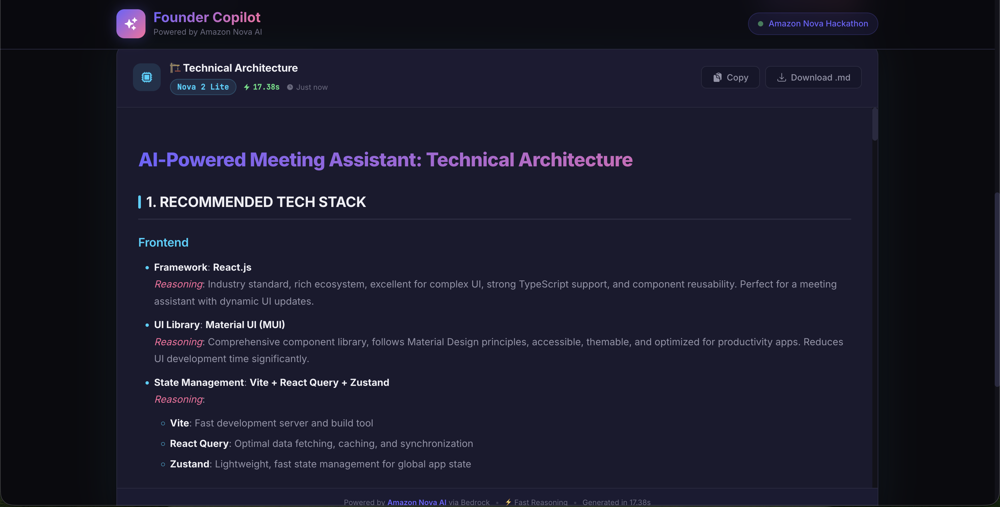

# 🚀 Founder Copilot

**AI-Powered Startup Helper Agent — Built for the Amazon Nova AI Hackathon**

Turn your startup idea into a comprehensive plan, technical architecture, development backlog, investor-ready pitch deck, and go-to-market strategy — all powered by **Amazon Nova AI** through Amazon Bedrock.

> **#AmazonNova** | Category: **Agentic AI** | Hackathon: [Amazon Nova AI Hackathon on Devpost](https://amazonnovaai.devpost.com/)


---

## 🎬 Demo Video

<!-- Replace this URL once your video is uploaded -->
> 🎥 **[Watch the Demo on YouTube](https://youtube.com/YOUR_VIDEO_LINK)** — ~3 minutes | `#AmazonNova`
>
> **Demo flow:** Launch app → Startup Plan generation → Tech Architecture → GitHub Issues → Pitch Deck → Marketing Strategy → Demo Mode (no AWS) → Streaming SSE in real time

---

## 🎯 Try It Instantly (No AWS Needed!)

Founder Copilot includes a **Demo Mode** that works without any AWS credentials. Just clone, install, and run:

```bash
git clone https://github.com/YOUR_USERNAME/Founder-Copilot.git
cd Founder-Copilot/backend && pip install -r requirements.txt && python run.py &
cd ../frontend && npm install && npm run dev
```

> 🧪 **Demo Mode** activates automatically when no AWS credentials are configured. It returns realistic sample outputs so you can explore every feature immediately.

---

## ✨ Features

| Feature | Description | Avg. Time |
|---------|-------------|-----------|
| 💡 **Startup Plan** | Comprehensive strategy with product description, target users, MVP features, 6-month roadmap, and success metrics | ~6-10s |
| 🏗️ **Tech Architecture** | Full tech stack recommendation with database schema, API endpoints, security considerations | ~7-12s |
| 📋 **GitHub Issues** | 15-20 prioritized development issues with estimates, acceptance criteria, and labels | ~8-14s |
| 🎤 **Pitch Deck** | 12-slide investor-ready pitch deck outline with talking points and visual suggestions | ~8-12s |
| 📣 **Marketing Strategy** | Full go-to-market plan with target audience analysis, channel breakdown, content strategy, and budget allocation (CMO-in-a-box) | ~6-10s |
| 🤖 **Auto-Detect** | Smart agent that detects your intent and routes to the right feature (uses Nova Micro for fast classification) | ~10-15s |
| 📡 **Streaming** | Real-time Server-Sent Events for progressive output rendering | Instant chunks |

### �� Amazon Nova Models Used

| Model | Bedrock Inference Profile ID | Role | Speed |
|-------|------------------------------|------|-------|
| **Nova 2 Lite** | `us.amazon.nova-2-lite-v1:0` | ⚡ Default — Gen 2 fast reasoning, great quality | ~4-8s |
| **Nova 2 Pro** | `us.amazon.nova-pro-v1:0` | ✨ Gen 2 high quality, comprehensive outputs | ~6-10s |
| **Nova Premier** | `us.amazon.nova-premier-v1:0` | 🏆 Most powerful (selectable) | ~8-12s |
| **Nova Micro** | `us.amazon.nova-micro-v1:0` | 🚀 Intent detection in Auto-Detect agent | ~2-4s |

---

## 📸 Screenshots

### Feature Selection & Input


### Generated Output — Startup Plan




### Generated Output — GitHub Issues




> 📷 **To add screenshots:** Run the app locally (`npm run dev`) and take screenshots at 1280×800 or wider. Save them to `docs/screenshots/` using the filenames above. See [`docs/SCREENSHOTS.md`](docs/SCREENSHOTS.md) for the full guide.

---

## 📝 Example Outputs (One-Liners)

Here's what each feature generates from a simple prompt like *"AI meeting assistant that records, summarizes, and creates action items"*:

| Feature | Sample Output Highlights |
|---------|-------------------------|
| 💡 **Startup Plan** | Product description, 3 user personas, 7 MVP features, 6-month roadmap with milestones, 7 KPIs, 3 risk mitigations |
| 🏗️ **Tech Architecture** | Next.js + FastAPI + PostgreSQL stack, system architecture diagram, 4-table database schema, 10 API endpoints, security & scaling notes |
| 📋 **GitHub Issues** | 17 prioritized issues (#1 Project Setup → #17 Rate Limiting), each with priority, estimate (S/M/L), acceptance criteria, and labels |
| 🎤 **Pitch Deck** | 12 slides (Cover → The Ask), $37B problem stat, TAM/SAM/SOM market sizing, competitive matrix, $2.5M ask with fund allocation |
| 📣 **Marketing Strategy** | 6-section GTM plan, channel matrix (SEO/Paid/Social/Email), content calendar, persona targeting, 90-day launch roadmap, KPIs |

---

## 📊 Performance Metrics

| Metric | Value |
|--------|-------|
| **Startup Plan generation** | ~4-8 seconds (Nova 2 Lite default) |
| **Tech Architecture generation** | ~4-8 seconds (Nova 2 Lite default) |
| **GitHub Issues generation** | ~5-10 seconds (Nova 2 Lite default) |
| **Pitch Deck generation** | ~4-8 seconds (Nova 2 Lite default) |
| **Marketing Strategy generation** | ~4-8 seconds (Nova 2 Lite default) |
| **Intent detection (Auto)** | ~1-2 seconds (Nova Micro) |
| **Demo mode response** | ~1-3 seconds (simulated) |
| **Average tokens per response** | 1,800 - 3,000 tokens |
| **Rate limit** | 10 requests/minute per IP |
| **Total codebase** | 32+ files, 3,100+ lines |

---

## 🛠️ Tech Stack

### Backend
- **Python 3.11+** with **FastAPI**
- **Amazon Bedrock** (Nova 2 Lite, Nova 2 Pro, Nova Premier, Nova Micro)
- **boto3** for AWS integration
- **slowapi** for rate limiting
- **Pydantic v2** for request/response validation

### Frontend
- **React 18** with **Vite 6**
- **react-markdown** for rendering
- **Framer Motion** for animations
- **react-icons** (Heroicons v2) for UI icons

---

## �� Quick Start

### Prerequisites
- Python 3.11+
- Node.js 18+
- *(Optional)* AWS Account with Bedrock access for real Nova AI responses

### 1. Clone the Repository

```bash
git clone https://github.com/YOUR_USERNAME/Founder-Copilot.git
cd Founder-Copilot
```

### 2. Backend Setup

```bash
cd backend
python -m venv venv
source venv/bin/activate  # On Windows: venv\Scripts\activate
pip install -r requirements.txt
```

### 3. Configure Environment

```bash
cp .env.example .env
```

**Option A: With AWS credentials (full power):**
```env
AWS_ACCESS_KEY_ID=your_access_key_here
AWS_SECRET_ACCESS_KEY=your_secret_key_here
AWS_REGION=us-east-1
```

**Option B: Demo mode (no credentials needed):**
```env
DEMO_MODE=true
# Or just leave AWS_ACCESS_KEY_ID and AWS_SECRET_ACCESS_KEY empty
```

### 4. Start Backend

```bash
cd backend
python run.py
```

Backend runs at: http://localhost:8000
API docs at: http://localhost:8000/docs

### 5. Frontend Setup

```bash
cd frontend
npm install
npm run dev
```

Frontend runs at: http://localhost:5173

---

## 📁 Project Structure

```
Founder-Copilot/
├── backend/
│   ├── app/
│   │   ├── __init__.py
│   │   ├── main.py              # FastAPI app entry point
│   │   ├── config.py            # Environment & settings (+ demo mode)
│   │   ├── nova_client.py       # Amazon Nova/Bedrock client
│   │   ├── prompts.py           # All prompt templates
│   │   ├── models.py            # Pydantic schemas
│   │   ├── routes.py            # API endpoints (7 routes)
│   │   └── demo_responses.py    # Mock data for demo mode
│   ├── run.py                   # Server runner
│   ├── requirements.txt
│   ├── .env                     # Your credentials (gitignored)
│   └── .env.example             # Template
│
├── frontend/
│   ├── src/
│   │   ├── components/          # React components (7 files)
│   │   ├── services/api.js      # API client with SSE streaming
│   │   ├── App.jsx              # Main app (state, routing, history)
│   │   ├── App.css
│   │   ├── index.css            # Global design system
│   │   └── main.jsx             # Entry point
│   ├── index.html
│   ├── package.json
│   └── vite.config.js
│
├── docs/
│   ├── screenshots/             # Demo screenshots
│   └── SCREENSHOTS.md           # Screenshot recording guide
├── README.md
├── PROJECT_REPORT.md            # Full system architecture report
└── .gitignore
```

---

## 🔌 API Endpoints

| Method | Endpoint | Description | Rate Limited |
|--------|----------|-------------|:------------:|
| `POST` | `/api/generate/startup-plan` | Generate startup plan | ✅ 10/min |
| `POST` | `/api/generate/tech-architecture` | Generate tech architecture | ✅ 10/min |
| `POST` | `/api/generate/github-issues` | Generate GitHub issues | ✅ 10/min |
| `POST` | `/api/generate/pitch-deck` | Generate pitch deck | ✅ 10/min |
| `POST` | `/api/generate/marketing-strategy` | Generate marketing strategy (CMO) | ✅ 10/min |
| `POST` | `/api/generate/auto` | Auto-detect & generate | ✅ 10/min |
| `POST` | `/api/generate/stream/{feature}` | Streaming generation (SSE) | ✅ 10/min |
| `GET`  | `/health` | Health check (includes `demo_mode` flag) | ❌ |

### Response Format

```json
{
  "feature": "startup_plan",
  "content": "# 💡 Startup Plan: ...",
  "model_used": "nova2lite",
  "tokens_used": 1847,
  "generation_time": 8.42,
  "demo_mode": false
}
```

---

## 🧪 Demo Mode

Founder Copilot includes a **built-in demo mode** for trying the app without AWS credentials:

| Aspect | Details |
|--------|---------|
| **Activation** | Automatic when `AWS_ACCESS_KEY_ID` is empty, or set `DEMO_MODE=true` |
| **Outputs** | Realistic, pre-written sample content for all 5 features |
| **UI Indicator** | Yellow "Demo Mode" badge in header + banner on outputs |
| **Latency** | 1-3 seconds simulated delay for realistic feel |
| **Streaming** | Simulated chunk-by-chunk streaming |

> This makes the app **instantly demoable** for hackathon judges without needing AWS access.

---

## 🎬 Demo Examples

Try these prompts to see what Founder Copilot generates:

### Example 1: AI Meeting Assistant
```
💡 Startup Plan: "AI-powered meeting assistant that records meetings, 
generates summaries, and creates action items automatically"
→ Generates: 6-section plan with 7 MVP features, 6-month roadmap, and KPIs
```

### Example 2: Freelancer SaaS
```
🏗️ Tech Architecture: "SaaS tool for freelancers to track time, 
send invoices, and manage clients"
→ Generates: Full stack recommendation, database schema, 10 API endpoints
```

### Example 3: AI Documentation Tool
```
📋 GitHub Issues: "Developer tool that uses AI to automatically 
write documentation from code comments"
→ Generates: 17 prioritized issues with estimates and acceptance criteria
```

### Example 4: EdTech Platform
```
🎤 Pitch Deck: "Personalized AI tutor that adapts to each student's 
learning style and pace"
→ Generates: 12-slide deck with market sizing, competitive matrix, and financial projections
```

### Example 5: B2B SaaS
```
📣 Marketing Strategy: "Project management tool for remote engineering teams"
  Target Audience: "CTOs and engineering managers at 10-100 person startups"
  Budget: "$5,000/month"
→ Generates: Full GTM plan with channel breakdown, content calendar, paid vs organic split, and 90-day launch roadmap
```

---

## 🔒 Security

| Feature | Implementation |
|---------|----------------|
| **Credentials** | AWS keys in `.env` (gitignored), never in code |
| **Rate Limiting** | 10 requests/minute per IP (slowapi) |
| **Input Validation** | Pydantic v2 schemas with min_length constraints |
| **CORS** | Configurable allowed origins |
| **Async Safety** | boto3 calls run in thread pool executor |
| **Error Handling** | Structured error responses (422, 429, 500) |

---

## 👨‍💻 Built For

**Amazon Nova AI Hackathon** — Demonstrating the power of Amazon Nova 2 Lite and Nova 2 Pro (Gen 2) alongside Nova Premier and Nova Micro for real-world startup tooling.

### What Makes This Special
- 🧠 **Nova 2 Gen 2 models** — Uses Nova 2 Lite (default) and Nova 2 Pro for all generation; Nova Micro for fast intent detection
- ⚡ **Production-ready** — Rate limiting, async safety, input validation, error handling
- 🎨 **Beautiful UI** — Dark theme with feature-colored accents, Framer Motion animations, responsive design
- 🧪 **Instantly demoable** — Works out of the box with demo mode (no AWS needed)
- 📊 **Metrics built-in** — Generation time, token count, and model info displayed on every output
- 📣 **Full founding team simulation** — Startup Plan (CEO), Tech Architecture (CTO), GitHub Issues (Engineering Lead), Pitch Deck (Investor Relations), Marketing Strategy (CMO)

---

## 🏆 Hackathon Submission

### Category
**Agentic AI** — Founder Copilot uses Amazon Nova's reasoning capabilities to simulate a full AI founding team. The Auto-Detect agent classifies user intent (via Nova Micro) and routes to the correct specialized Nova 2 generation agent, each with a distinct expert persona and structured multi-section output.

### Project Description *(copy-paste this into the Devpost submission form)*

> Founder Copilot is an AI-powered startup helper agent that turns any startup idea into a complete founder package in seconds. Powered entirely by **Amazon Nova 2 Lite** and **Nova 2 Pro** (Gen 2) via Amazon Bedrock, it simulates a full founding team:
>
> - 💡 **CEO** → Startup Plan (strategy, roadmap, KPIs)
> - 🏗️ **CTO** → Technical Architecture (stack, schema, API design)
> - 👩‍💻 **Engineering Lead** → GitHub Issues (prioritized dev backlog)
> - 🎤 **Investor Relations** → Pitch Deck (12-slide investor outline)
> - 📣 **CMO** → Marketing Strategy (GTM plan, channels, 90-day roadmap)
>
> An **Auto-Detect agent** (Nova Micro) classifies the user's natural language input and routes it to the right specialist automatically. All generation uses real-time **Server-Sent Events (SSE) streaming** for a live typewriter experience. Includes **instant Demo Mode** (no AWS required) so judges can test every feature without credentials.
>
> Built with FastAPI + React + Amazon Bedrock. #AmazonNova

### How It Uses Amazon Nova

| Nova Model | Bedrock Inference Profile ID | Role in App |
|-----------|------------------------------|-------------|
| **Nova 2 Lite** | `us.amazon.nova-2-lite-v1:0` | Default generation model — all 5 features |
| **Nova 2 Pro** | `us.amazon.nova-pro-v1:0` | High-quality generation option |
| **Nova Premier** | `us.amazon.nova-premier-v1:0` | Most powerful (selectable) |
| **Nova Micro** | `us.amazon.nova-micro-v1:0` | Intent classification in Auto-Detect agent |

### Testing Instructions for Judges

```bash
# Clone the repo
git clone https://github.com/YOUR_USERNAME/Founder-Copilot.git
cd Founder-Copilot

# Start backend (Demo Mode works without AWS credentials)
cd backend && pip install -r requirements.txt && python run.py &

# Start frontend
cd ../frontend && npm install && npm run dev
# → Open http://localhost:5173
```

> 🧪 **No AWS account needed** — Demo Mode activates automatically if no credentials are set.
> For real Nova AI responses, add your AWS credentials to `backend/.env`.

**Grant repo access for judging (if repo is private):**
Share with `testing@devpost.com` and `Amazon-Nova-hackathon@amazon.com`

---

## 📝 License

MIT License — Built with ❤️ and Amazon Nova AI
